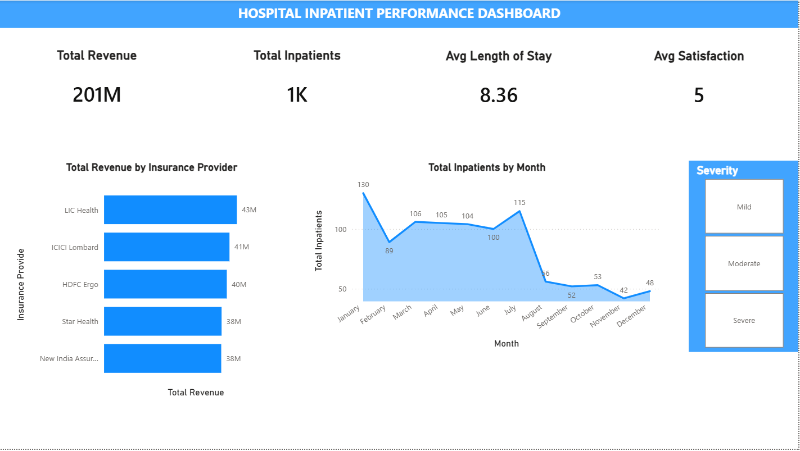
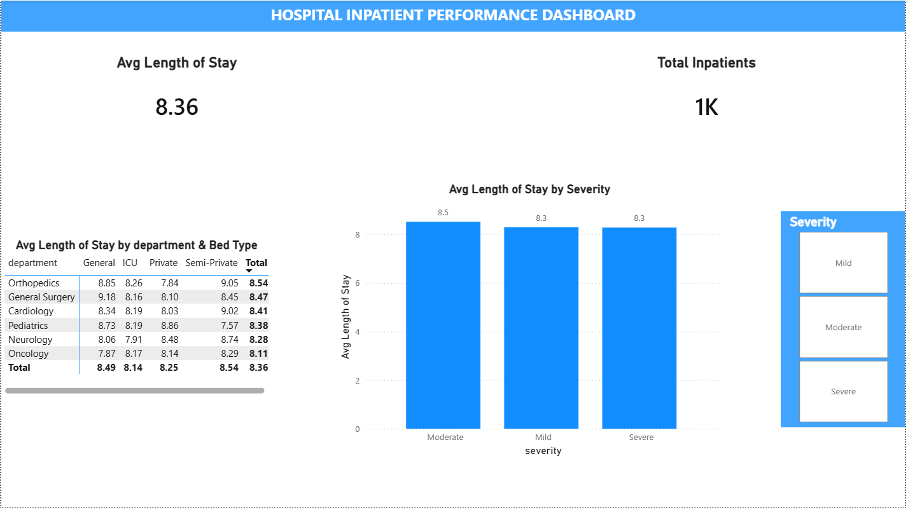
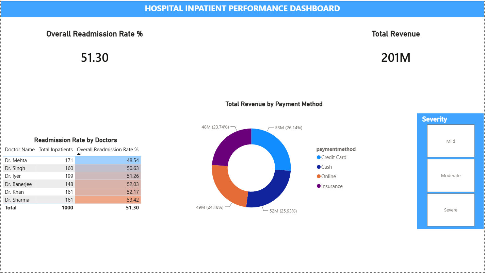

# Hospital Inpatient Revenue & Bed Operations Analysis

## Project Overview
In this project, I analysed inpatient data from a hospital to help management understand room availability, revenue streams, and patient care quality. The goal was to find practical insights to improve daily operations and shorten patient wait times.

---

## Dashboard Preview

| Page 1: Executive Overview | Page 2: Bed Operations | Page 3: Clinical & Finance |
| :---: | :---: | :---: |
|  |  |  |

> *Note: You can check the `hospital_analysis.sql` file in this repository to see all the SQL data cleaning steps and analysis queries.*

---

## Key Findings & Recommendations

### 1. Hospital Bed Usage & Patient Flow
* **Problem:** Hospital beds are limited. When patients stay too long in low-cost rooms, it blocks new patients who need emergency or high-value surgery.
* **Main Finding:** Patients in General Surgery (using General beds) and Orthopedics (using Semi-Private rooms) stayed the longest, averaging around 9 days.
* **My Suggestion:** The hospital should create standard recovery plans for surgery patients and speed up the discharge paperwork to free up beds faster.

### 2. Payment Methods & Insurance Performance
* **Problem:** The finance team needs to know which payment methods and insurance companies bring in the most money and clear payments smoothly.
* **Main Finding:** Corporate **Insurance** payments had the highest average bill size (~2.10 Lakhs). Among private insurers, **Star Health** had the largest average claim amount (~2.05 Lakhs).
* **My Suggestion:** Set up a dedicated desk for Star Health approvals to get claims cleared quickly and avoid payment delays.

### 3. Patient Care Quality & Readmission Rates
* **Problem:** Patients coming back to the hospital shortly after discharge (readmission) increases costs and shows potential gaps in care quality.
* **Main Finding:** Using a doctor performance scorecard, I found a few specific doctors with high patient readmission rates and lower satisfaction scores.
* **My Suggestion:** Senior medical staff should review these specific cases to make sure patients are fully recovered before sending them home.

### 4. Patient Age & Case Severity
* **Problem:** Checking if patients with severe conditions are staying longer and paying more than patients with mild conditions.
* **Main Finding:** While **Severe** cases had the highest bills (~2.04 Lakhs), patients with **Mild** issues surprisingly stayed in beds for almost the same length of time (~8.3 days).
* **My Suggestion:** Mild cases are taking up valuable beds unnecessarily. The hospital can move these patients to outpatient care or same-day treatment units.

---

## Tools Used
* **Data Cleaning & Analysis:** SQL (MySQL)
* **Data Visualization:** Power BI (3-Page Interactive Dashboard)
